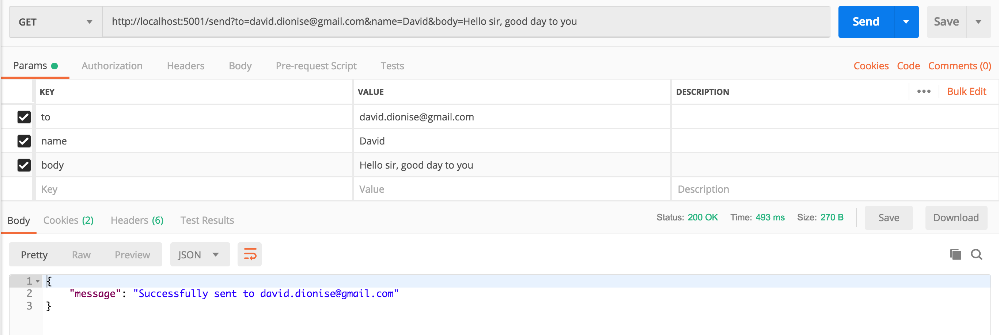

### Run the app

_You must have node and npm installed to run the app_

1. Navigate to the root directory of the project and execute the command `npm install`
1. Execute the command `API_KEY=<mailgun api key from 1Pass> node server.js`
1. The server will start on port `5001`

### Make a request

1. The server exposes one endpoint - `GET /send`
1. You must pass in three query parameters:
  - `to` - The email address that will receive the email
  - `name` - A variable to populate a name in the email
  - `body` - A variable to populate the body of the email

